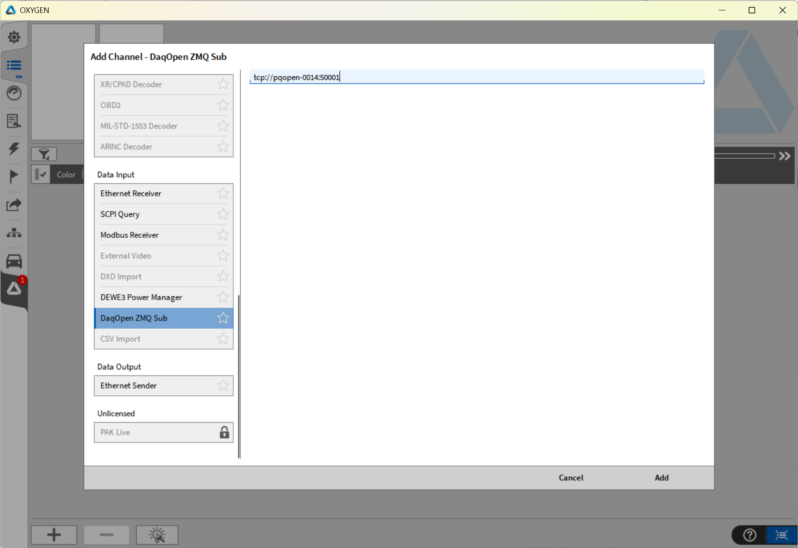
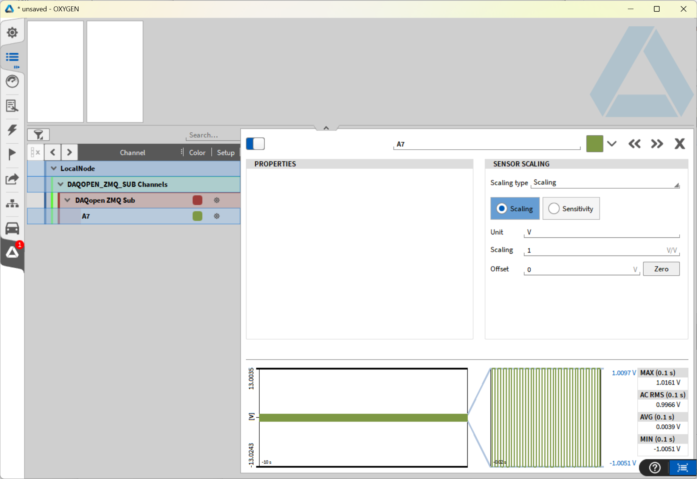

# daqopen-oxygen-plugin

This is a plugin for DEWETRON OXYGEN measurement software to receive live data from the daqopen-zmq-server.

## Features

- Subscribe to DaqOpen ZMQ publisher and stream data

- Automatically create available live channels

## Installation Instructions

1. Download and Install OXYGEN (minimum required version 7.2.1)

2. Download the release package (available soon)

3. Unzip and copy the two files to C:\Program Files\DEWETRON\OXYGEN\bin

## Usage

1. Configure and Start the **daq-zmq-server** on your edge device or a local simulation: 
   [GitHub - DaqOpen/daqopen-apps](https://github.com/DaqOpen/daqopen-apps#daq-zmq-server)

2. Start OXYGEN

3. Open channel list
   

4. Press [+] in the lower left corner, navigate to Data Input and select "DaqOpen ZMQ Sub" and insert the correct connection string.
   

5. Press **Add** and open the channel tree of the new node and inspect the loaded channels

6. Now start measuring and analyzing 

## Known Issues

This plugin is in early stage, only the "happy-path" is working, no error handling

- [ ] Init is blocking forever and waiting for first data package from daqopen-zmq-server

- [ ] Data gaps are not handled in case of server re-connecting

## Build Instructions for Windows

1. Download and prepare OXYGEN SDK (follow instructions here: [Quickstart &#8212; Oxygen SDK 6.1 documentation](https://dewetron.github.io/OXYGEN-SDK/02_Quickstart/Quickstart.html))

2. Download, compile and install ZMQ and CPPZMQ [GitHub - zeromq/cppzmq: Header-only C++ binding for libzmq](https://github.com/zeromq/cppzmq?tab=readme-ov-file#build-instructions)

3. Download [json/single_include/nlohmann/json.hpp at develop · nlohmann/json · GitHub](https://github.com/nlohmann/json/blob/develop/single_include/nlohmann/json.hpp) and copy in daqopen-oxygen-plugin folder

4. **Open** the daqopen-oxygen-plugin in VS Code (or your IDE) and configure CMAKE

5. **Build** the plugin

6. **Deploy** the **plugin** AND the **libzmq**
   
   1. copy the daqopen-oxygen-plugin\build\Release\plugins\daqopen-oxygen-plugin.plugin to C:\Users\Public\Documents\Dewetron\Oxygen\Plugins
   
   2. Copy the C:\Program Files (x86)\ZeroMQ\bin\libzmq-v143-mt-4_3_5.dll to C:\Program Files\DEWETRON\OXYGEN\bin

## License

MIT